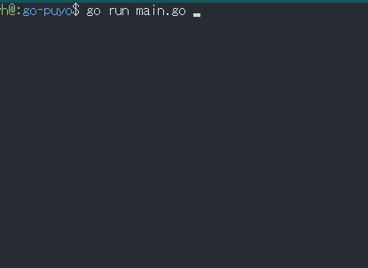

# Go-Puyo
Go-Puyo is terminal based 'Puyo Puyo' similar game written in Go language.



## What is puyo puyo?
https://en.wikipedia.org/wiki/Puyo_Puyo

## How to get and run the code.
### build version
go1.12.17 
 
### 1st step
Get the code.

```
go get -d github.com/y-hatano-github/go-puyo
```
### 2nd step
Change directory to the source code directory.

```
cd $GOPATH/src/github.com/y-hatano-github/go-puyo
```
### 3rd step
Run the code.

```
go run main.go
```

## How to play
Key bindings<br>
[enter] - start game<br>
[esc] - exit<br>
[space] - drop<br>
[a/arrow left] - move left<br>
[d/arrow right] - move right<br>
[w/arrow up] - rotate left<br>
[s/arrow down] - rotate right<br>
[p] - pause/resume<br>

## Win/Mac/Linux binary
https://github.com/y-hatano-github/go-puyo/releases/
